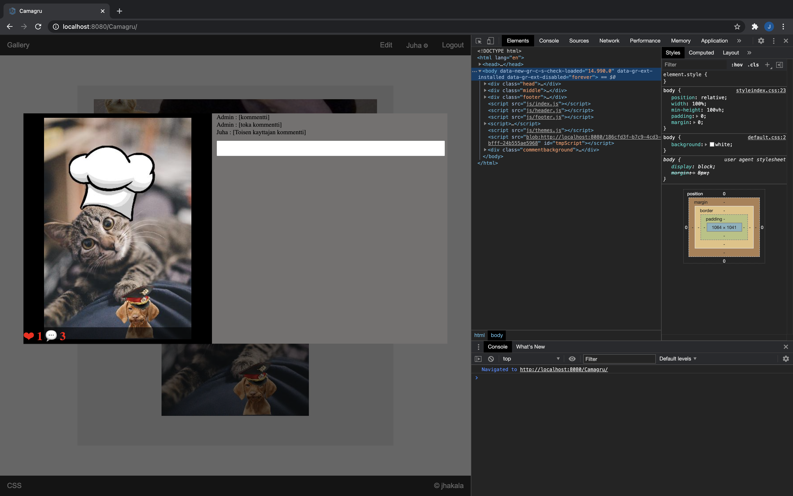
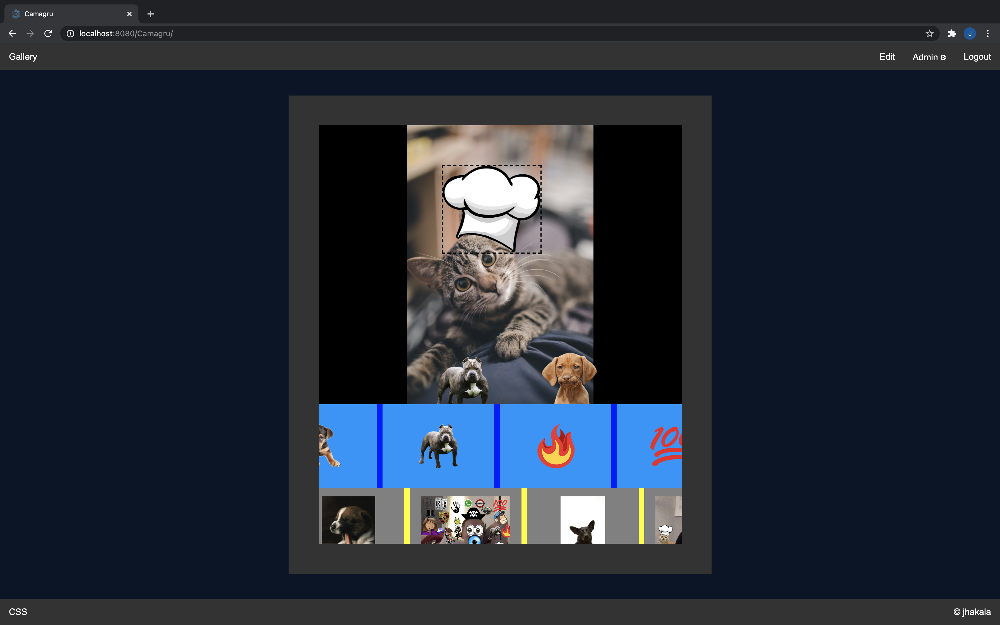

# Camagru

```
 This web project is challenging you to create a small web application allowing you to
 make basic photo and ~~video~~ editing using your webcam and some predefined images.
```

```
- User features:
  - [x] Sing up/in
  - [x] verify email
  - [x] password reset email
  - [x] change password/email/login and delete user
  - [x] email notifications preference
```

```
- Gallery features:
  - [x] show images of all users
  - [x] comment/like images
  - [x] if commented, send email to author of image (if preference true)
```


```
- Editing features:
  - [x] preview of user webcam
  - [x] thumbnails of users images
  - [x] button to capture image 3s timer
  - [x] spacebar to capture immediately
  - [x] stickers
    - [x] move
    - [x] resize
  - [x] process superposing of images in server with php
  - [x] allow to upload image to edit/add stickers to
  - [x] delete own edited images
```  


```
- Constraints and Mandatory things:
  - Authorized languages:
    - [x] Server => PHP
    - [x] Client => HTML - CSS - JavaScript (only with browser natives API)
  - Authorized frameworks:
    - [x] Server => None
    - [x] Client => CSS Frameworks tolerated, unless it adds forbidden JavaScript.
  - Database connection:
    - [x] PDO::ERRMODE_EXCEPTION
```

```
Bonus:
  - [x] “AJAXify” exchanges with the server (with no Ajax or jquerry).  
          "refers to modifying the code to make HTTP requests via JavaScript.  
           to load and display new data without reloading the entire page".  
           - Michael Berkowsk
  - [x] decent looking with no bootstrap
  - [x] infinity gallery
  - [x] css alltering (themes/likes/infinity toggle)
  - [x] one page app
```


```
- elements dont overlap in phone or resizing the window 
```

